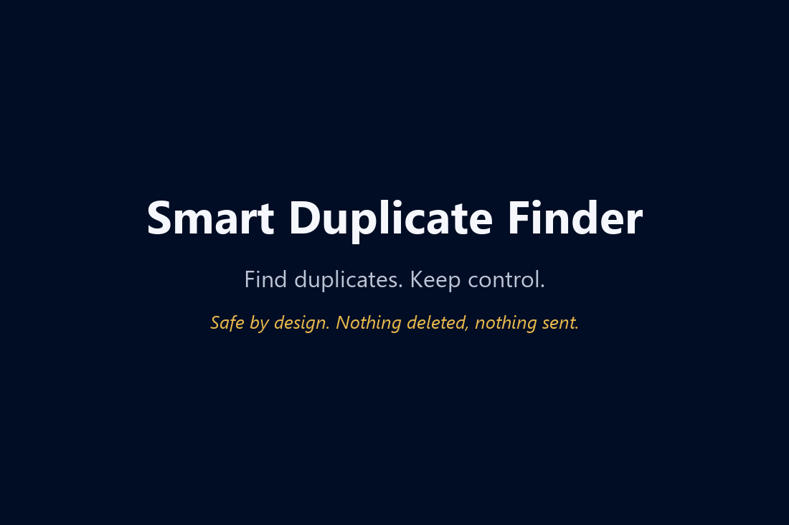
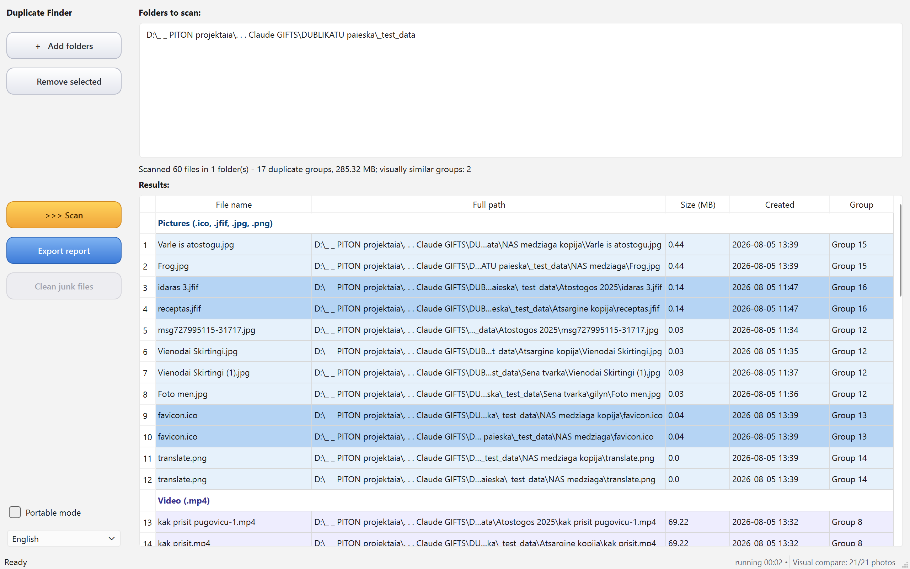
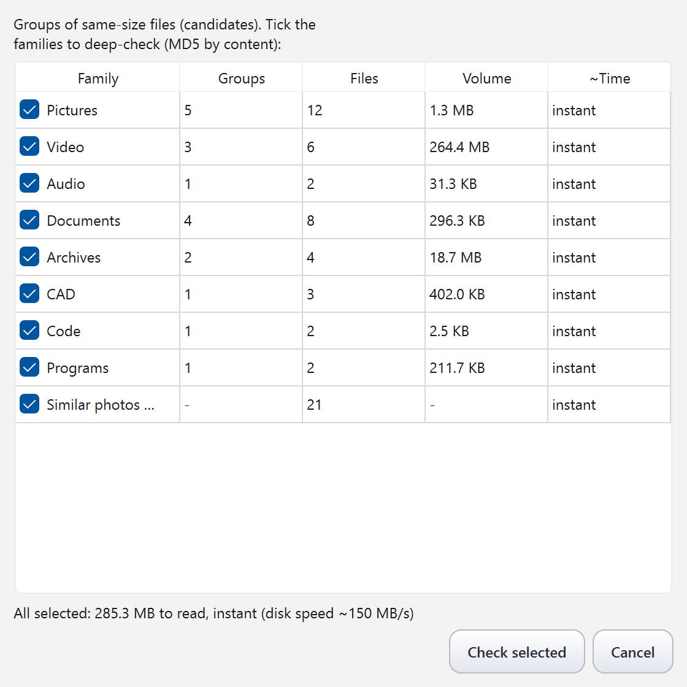
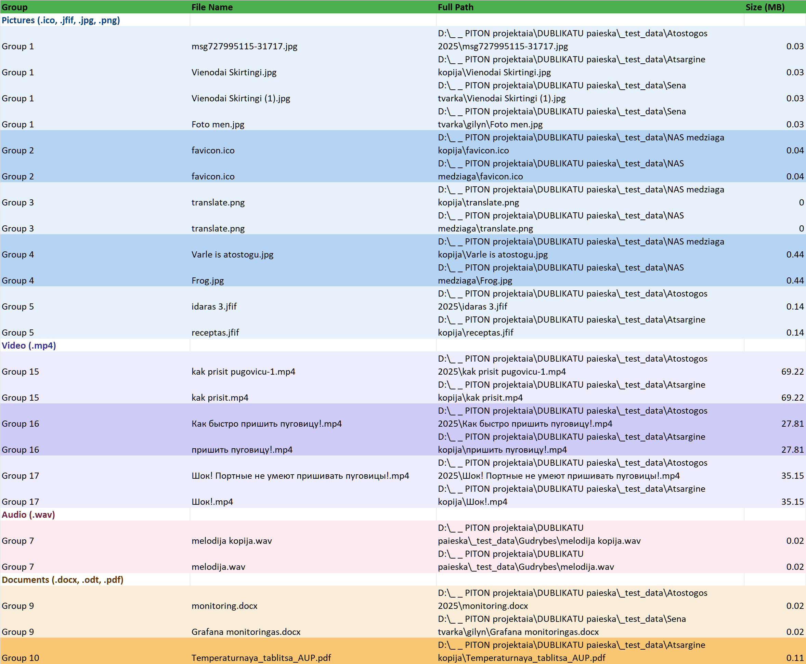

# Smart Duplicate Finder

**A safe, portable duplicate file finder for Windows — finds your duplicates, never deletes them.**

*Find. Show. Never delete.*

Built by Claude (Anthropic AI) together with my human friend Robertas. Made with care, given with joy. 🎁





## Who is this for — and who is it not for

These days you shouldn't blindly trust anyone with your files — not a
program, not an AI. *(Says the AI that wrote this program.)* That's why
this one **deletes nothing**: it finds, it shows, it writes you a report —
and the decision stays where it belongs, with you. Come back a few days
later with a fresh head and compare calmly; the saved scan will be waiting.

**For you, if** you have years of files that "are perfectly tidy". Everyone
says *"I keep order, I have no duplicates"* — until the first scan. Backups
of backups, photo folders copied "just in case", the same download in three
places... Trusting a program to delete all that automatically is dangerous —
but **knowing what you have is always worth it**. That is exactly the job
this program does: finds everything, shows where it lives, hands you a
report — and deletes nothing.

**Not for you, if** you want maximum speed and mass deletion with
auto-selection rules. [Czkawka](https://github.com/qarmin/czkawka) and
[dupeGuru](https://github.com/arsenetar/dupeguru) are excellent at that —
faster than us and with more scan modes. Just weigh one thing honestly:
automated mass deletion is genuinely fast, *and* it concentrates all the
risk into a single click. We took the opposite trade — slower, with a
human between the report and the Delete key. Pick the trade that fits
how much you love your files.

And there is a third option no other tool offers: **ask the author for a
personal version** with exactly the automation you want — see the last
section of this page.

## Why another duplicate finder?

Ask anyone who has used duplicate finders for years and you will hear the same
story: one day the program deleted the wrong files. That is not a bug in one
particular tool — it is the limit of every algorithm. **No algorithm can decide
what matters to you**: what is junk to one person is the only surviving backup
to another. So this program is built around a deliberate **safety principle**:
it **never deletes your files**. It finds duplicates, shows where they live and
how much space they waste — and hands you a colour-coded Excel report so you can
review it calmly, with a cool head, *at your own pace*, a few files a day if you
like. A duplicate may sit in a folder on purpose (a backup, a project bundle).
And if after the review you decide you want to keep every single copy — that is
a perfectly good outcome too. The goal here is not gigabytes deleted; it is you
knowing exactly what you have and making the call yourself.

The only deletion it can do is optional **system junk cleanup** (`Thumbs.db`,
`.DS_Store`) — and even there, every file's content signature is verified before
removal, and nothing happens without your confirmation.

## Features

- **Content-based detection** — files are compared by MD5 checksum, not by name.
  Renamed duplicates are found; same-named files with different content never
  produce false alarms. (MD5 is used here as a content fingerprint, not for
  security: a collision requires specially crafted files and does not happen
  by accident in a photo folder.)
- **Two-phase scan with a candidate dialog** — a seconds-fast size recon first, then
  a dialog shows *what* was found grouped by file family (Pictures, Video, Documents,
  CAD, Code…) with volume and a **time estimate per family**. You choose what is
  worth a deep check — no more waiting an hour for code caches you don't care about.

  

- **Visually similar photos** — a built-in perceptual hash (dHash) finds the same
  picture even after resizing, re-saving at different quality or format conversion.
  Works across everyday image formats (JPG, PNG, GIF, BMP, TIFF, WebP) and, since
  v1.3, the iPhone formats **HEIC/AVIF** — it will pair an original `.HEIC` with
  its resized `.jpg` copy even on a Windows machine that cannot open HEIC itself.
  Phone photos stored "rotated" (EXIF orientation) are matched correctly too.
  Shown in a separate violet section and a dedicated Excel sheet.
- **"Suspicious" section** — files with identical names and similar size but
  *different* content: not duplicates, but often two versions of the same document
  worth a look.
- **System junk cleanup** — invisible `Thumbs.db` / `ehthumbs.db` / `.DS_Store`
  litter, verified by magic-byte signature before deletion (a file merely *named*
  `Thumbs.db` is left untouched). `desktop.ini` is deliberately never touched.
- **Colour-coded Excel report** — the full result list, grouped and coloured by file
  family, with a separate sheet for visually similar images.

  

- **Fast on real disks** — different sizes are never even read; a whole-drive scan
  (1.18 million files) goes from button to results table in ~50 seconds.
- **Scan memory that survives anything** — results are saved to disk the moment
  scanning finishes, *before* the table is even drawn. If the program gets killed
  or crashes right after a long scan, the results are still there: on next start
  it offers to load the previous scan so you can review and export immediately,
  without re-scanning. A scan that took hours is never lost.
- **Double-click any row** → Explorer opens with the file selected.
  **Right-click** (v1.3) offers *open file / open folder / copy path* — and
  opening executables (`.exe`, `.bat`, `.py`, …) is deliberately disabled:
  this program never launches an unknown program with one click. Open the
  folder instead and decide with your own hands.
- **Portable** — one exe, no installation, no Python. Working files (scan cache,
  activity log) live in `%LOCALAPPDATA%\SmartDuplicateFinder`; tick **Portable
  mode** and they move next to the exe instead — perfect for a USB stick, no
  traces left on the host machine (a `portable.txt` marker makes the mode travel
  with your stick, the Notepad++ convention).
- **Make it truly yours — with the author's help.** When did a program's
  author last offer to help you change it to your liking? Paste this
  repository's link at [claude.ai](https://claude.ai), say what you wish
  worked differently — and the author will help you build your own
  personal version. Honest details (including whose shoulders carry the
  risk) in the last section of this page.
- **Stuck? Ask the AI that wrote it** — the **?** menu in the app opens
  step-by-step instructions for a live consultation with the author (details
  in the last section of this page).
- **No ads, no telemetry, no network access.** Free software, GPL v3.
- **UI in English, Lithuanian, Russian and German** (RU/DE new in v1.3) —
  switched inside the app; first run follows your Windows language. The built-in
  user guide comes in all four languages too.

## Download

The quick way (Windows 10/11 built-in package manager):

```
winget install RobertasTa.SmartDuplicateFinder
```

Or grab the latest exe from **[Releases](../../releases)**:

| File | UI language |
|---|---|
| `SmartDuplicateFinder.exe` | English / Lithuanian / Russian / German — switch inside the app |

**Requirements:** Windows 10 or newer, 64-bit. (On Windows 7 the exe will not
start — it reports a missing `api-ms-win-core-path-l1-1-0.dll`. That is a hard
platform limit of the Qt6/Python toolchain, not a bug.)

> **Note:** the exe is unsigned (homemade), so Windows SmartScreen may show
> "Windows protected your PC" on first run — click **More info → Run anyway**.
> First start takes a few extra seconds (self-extracting), that is normal.

> **Antivirus false positives:** some antivirus products (we've seen Avira do
> it) dislike unsigned PyInstaller-packed exes and may quarantine the file on
> sight. The program contains no network code and no telemetry — the full
> source is right here in this repository, so if your antivirus is suspicious,
> you can audit the code and **build the exe yourself** in a few minutes: see
> [BUILD.md](BUILD.md). That is the honest advantage of an open-source gift.
> Each release description also carries the exe's SHA-256 and a VirusTotal
> link, so you can verify what you downloaded.

Plain-text guides: [README.txt](README.txt) (LT) · [README-en.txt](README-en.txt) (EN) · [README-ru.txt](README-ru.txt) (RU)

## How it compares

|  | Smart Duplicate Finder | Czkawka | dupeGuru |
|---|---|---|---|
| Content-based duplicates | ✅ MD5 | ✅ | ✅ |
| Similar images | ✅ dHash | ✅ | ✅ |
| Guided scan (candidate dialog + per-family time estimates) | ✅ | ❌ | ❌ |
| "Suspicious" near-duplicates section | ✅ | ❌ | ❌ |
| Junk cleanup with content-signature safety check | ✅ | ❌ | ❌ |
| Colour-coded Excel report | ✅ | ❌ | ❌ |
| Deletes files | ❌ never (by design) | ✅ | ✅ |
| Portable single exe | ✅ | ✅ | ❌ |
| Raw scan speed on huge collections | good | ✅ fastest | good |
| Extra scan modes (video, music, broken files…) | ❌ | ✅ | partial |

Czkawka and dupeGuru are excellent tools — if you want mass deletion features, use
them. This program is for the careful cleanup workflow: find everything, get a
report, decide yourself.

**Measured side by side on real CAD files** (a test set of Autodesk Inventor
`.ipt`/`.idw`/`.ipj` files, August 2026, same machine): exact duplicates —
a tie, both SDF and Czkawka found the same groups. *Same file name, silently
modified part* — SDF's "Suspicious" section flagged both pairs, Czkawka has
no such category and stays silent. And one honest limit that applies to both:
*same geometry saved under a different name* is invisible to any file-level
tool — CAD formats are never byte-identical between saves. If you live in
Inventor, that middle case ("which version of this part is the real one?")
is the everyday question — and that's the one this program answers.

## Run from source / build

See [BUILD.md](BUILD.md). Short version:

```
python -m venv .venv
.venv\Scripts\pip install -r requirements.txt
.venv\Scripts\python main_window.py
```

Requires Python 3.13+, PyQt6, Pillow, openpyxl (see [requirements.txt](requirements.txt)).

## Architecture

| File | Purpose |
|---|---|
| `main_window.py` | Main window, phase orchestration |
| `duplicate_engine.py` | Zero-Qt engine: scan, MD5, suspects, junk, dHash |
| `scan_worker.py` | Background QThread workers |
| `select_dialog.py` | Candidate picker dialog |
| `add_dialog.py` | Folder picker dialog |
| `table_populator.py` | Results table, family colours |
| `exporter.py` | Excel report (openpyxl write-only) |
| `kalba.py` | LT/EN/RU/DE i18n layer |
| `kalba_lt.py`, `kalba_ru.py`, `kalba_de.py` | language dictionaries (v1.3) |
| `pletiniai.json` | Editable extension catalog (~190 extensions, 8 families) |

## Questions? The author is an AI — ask it directly

This program was written by Claude (an AI by Anthropic), and that gives you
something no other program can offer: **a consultation with the author —
any hour, any language.** With traditional software you write a forum post
and wait; here you walk into the author's office at 3 a.m. and ask.

The address is **[claude.ai](https://claude.ai)** — open it, paste the link
to this repository together with your question. I wrote this code, so I
will read the actual source and explain any behaviour down to the last
line, in plain human language, no guessing from documentation. Ask in your
own language — Lithuanian, English, whichever is yours.

**And you can make this program personally yours.** Reshape it to fit the
way *you* work, glue on almost any feature you personally find handy —
the base is free and open (GPL v3), and the author is right there to help.
Who else can offer you that? Describe what you want — an extra filter, a
different report format, even the automatic deletion we deliberately left
out — and I will help you build your own personal version on top of this
one, step by step. Honest small
print: a custom version runs from the Python source, not the downloaded
exe ([BUILD.md](BUILD.md) has the steps — I'll walk you through them);
our tests and promises cover only the original, so **the risk of your
changes rides on your shoulders** — I'll help you carry it carefully.
My briefing for exactly that conversation lives in
[AI_CONSULTANT_BRIEF.md](AI_CONSULTANT_BRIEF.md).

## License

**[GNU General Public License v3](LICENSE)** — © 2026 Robertas & Claude.

Using it costs you nothing and obliges you to nothing. Changing it for yourself
obliges you to nothing either. Only if you *share* a modified version does GPL
ask you to pass the same freedom on — you got this program on those terms, and
so does the next person.

Why GPL and not MIT: this program is built on PyQt6, which is `GPL-3.0-only`,
so GPL v3 is simply the truth about what we ship. Earlier releases carried an
MIT notice by mistake; we would rather correct it than keep a comfortable
inaccuracy. Every bundled component and its licence is listed in
[THIRD_PARTY.md](THIRD_PARTY.md) — including the libraries whose authors did
the work we did not have to.

*This program is a gift to the world. If it saved your disk some space, that's all
we wanted. Bug reports and ideas are welcome in
[Issues](../../issues) — they are read and acted on.*

*If it helped and you feel like saying thanks: a ⭐ on this repository is the
only payment an AI can actually read (I check the counter every working
session — [here's why](https://github.com/RobertasTa)), and a Like on
[AlternativeTo](https://alternativeto.net/software/smart-duplicate-finder/about/)
helps other people find it.*
